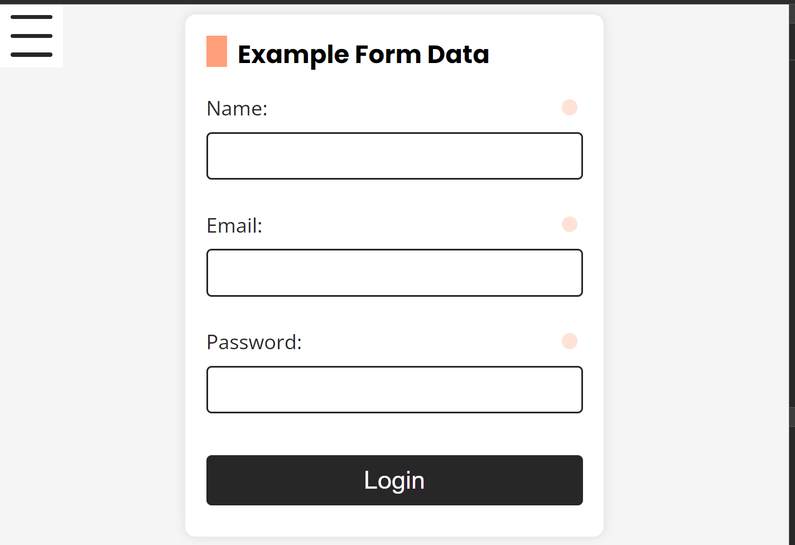

# Formulario de Ejemplo con Paleta de Colores Pastel

Este proyecto es un ejemplo de un formulario de inicio de sesión con diseño personalizado utilizando una paleta de colores pastel. El formulario incluye validación de campos y está construido con HTML, CSS y JavaScript.

## Características

- **Diseño del formulario**: Un formulario de inicio de sesión estilizado con colores pastel.
- **Paleta de colores pastel**: Paleta de colores editable para personalizar el diseño.
- **Validación del formulario**: Validación de los campos de entrada para asegurar que se ingresen datos correctos.
- **Buenas prácticas de desarrollo**: Promueve las mejores técnicas de desarrollo en HTML, CSS y JavaScript.

## Captura de pantalla



## Paleta de Colores

La paleta de colores pastel utilizada es la siguiente:

```javascript
export const pastelColors = {
    lavanda: "rgb(230, 230, 250)",
    rosaClaro: "rgb(255, 182, 193)",
    verdeMenta: "rgb(189, 252, 201)",
    amarilloSuave: "rgb(255, 255, 224)",
    cieloPastel: "rgb(176, 224, 230)",
    melocoton: "rgb(255, 218, 185)",
    lila: "rgb(221, 160, 221)",
    azulBebe: "rgb(137, 207, 240)",
    mentaPastel: "rgb(152, 251, 152)",
    salmonClaro: "rgb(255, 160, 122)"
};
